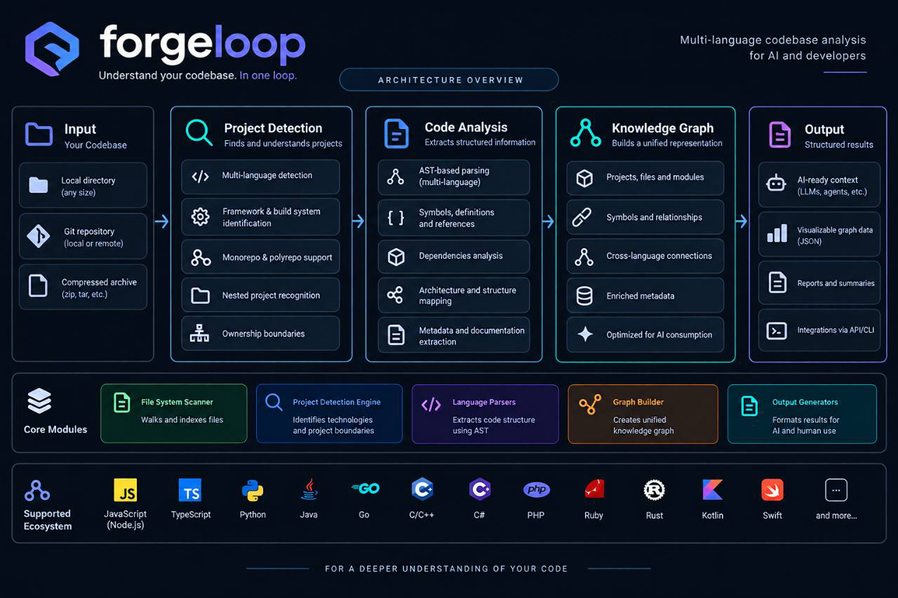

# ForgeLoop — Verifiable Engineering Protocol

<p align="center">
  
</p>

[](https://github.com/cassiomc1/forgeloop/actions/workflows/codeql.yml)
[](https://github.com/cassiomc1/forgeloop/actions/workflows/dependency-review.yml)
[](https://github.com/cassiomc1/forgeloop/actions/workflows/docs-quality.yml)
[](https://github.com/cassiomc1/forgeloop/actions/workflows/forgeloop-audit.yml)
[](https://github.com/cassiomc1/forgeloop/actions/workflows/npm-publish.yml)
[](https://github.com/cassiomc1/forgeloop/actions/workflows/package-smoke.yml)
[](https://github.com/cassiomc1/forgeloop/actions/workflows/release-notes.yml)

ForgeLoop is a protocol CLI for AI-assisted development.
It turns outcomes into contracts, deterministic routing, resumable state,
evidence-backed verification, recovery, cross-harness continuity, repository
discovery, and validator-backed completion—not an agent or LLM runtime.

Operational sources are indexed in [`DOCS_INDEX.md`](./DOCS_INDEX.md).
[`LOOP_ENGINEERING.md`](./LOOP_ENGINEERING.md) is canonical;
[`PROTOCOL_INTEGRATION.md`](./PROTOCOL_INTEGRATION.md) defines discovery,
[`PROJECT_PROFILE.md`](./PROJECT_PROFILE.md) stores project facts, and
[`GUIDE_ROUTER.md`](./GUIDE_ROUTER.md) selects relevant guides.

## Where should I start?

- **New to ForgeLoop** → [`docs/GETTING_STARTED.md`](./docs/GETTING_STARTED.md)
- **Inspect a real ForgeLoop execution** → [`poc/README.md`](./poc/README.md)
- **Full protocol specification** → [`LOOP_ENGINEERING.md`](./LOOP_ENGINEERING.md)
- **Integrating an AI harness** → [`PROTOCOL_INTEGRATION.md`](./PROTOCOL_INTEGRATION.md)
- **Optional advisory context providers** → [`docs/ADVISORY_CONTEXT.md`](./docs/ADVISORY_CONTEXT.md)
- **Agent bootstrap summary** → [`docs/AGENT_PROTOCOL_SUMMARY.md`](./docs/AGENT_PROTOCOL_SUMMARY.md)
- **Continuing another harness's task** → [`docs/CROSS_HARNESS_CONTINUITY.md`](./docs/CROSS_HARNESS_CONTINUITY.md)
- **CLI command reference** → [`docs/CLI_REFERENCE.md`](./docs/CLI_REFERENCE.md)
- **Artifact & schema reference** → [`docs/ARTIFACT_REFERENCE.md`](./docs/ARTIFACT_REFERENCE.md)
- **Operational recipes** → [`docs/RECIPES.md`](./docs/RECIPES.md)
- **Structural quality feedback** → [`docs/STRUCTURAL_QUALITY.md`](./docs/STRUCTURAL_QUALITY.md)
- **Troubleshooting & error codes** → [`docs/TROUBLESHOOTING.md`](./docs/TROUBLESHOOTING.md)
- **Code attestation & revision coverage** → [`docs/CODE_ATTESTATION.md`](./docs/CODE_ATTESTATION.md)
- **System architecture & safety** → [`LOOP_SYSTEM_DESIGN.md`](./LOOP_SYSTEM_DESIGN.md) & [`THREAT_MODEL.md`](./THREAT_MODEL.md)
- **Documentation index & ownership** → [`DOCS_INDEX.md`](./DOCS_INDEX.md)

## Real execution proof

Public [execution PoC](./poc/README.md) covers workload, protocol
artifacts, trusted provenance, receipts, evidence, and audit. It reached
validator-backed `COMPLETE / VALID` and preserves a later
`E_RECEIPT_PATH_MISMATCH` after publication changed the repository.

- [Canonical technical audit](./poc/reports/poc-20260826-real-execution-technical-audit-v2.md)
- [Evidence package](./poc/evidence/poc-20260826-real-execution/)

## Catalog

| Topic | Guide |
| --- | --- |
| Premium websites | [`ENG/premium-sites-studio-eng.md`](./ENG/premium-sites-studio-eng.md) |
| Clean code | [`ENG/clean-code-eng.md`](./ENG/clean-code-eng.md) |
| Testing | [`ENG/test-code-eng.md`](./ENG/test-code-eng.md) |
| Security | [`ENG/sec-code-eng.md`](./ENG/sec-code-eng.md) |
| Design and UX | [`ENG/design-code-eng.md`](./ENG/design-code-eng.md) |
| Taste frontend | [`ENG/taste-frontend-eng.md`](./ENG/taste-frontend-eng.md) |
| Performance | [`ENG/perf-code-eng.md`](./ENG/perf-code-eng.md) |
| Accessibility | [`ENG/accessibility-eng.md`](./ENG/accessibility-eng.md) |
| Web games | [`ENG/games-code-design-web-eng.md`](./ENG/games-code-design-web-eng.md) |
| Documentation quality | [`ENG/documentation-quality-eng.md`](./ENG/documentation-quality-eng.md) |
| Flutter | [guide](./ENG/flutter-development-eng.md) |
| .NET and ASP.NET Core | [guide](./ENG/dotnet-aspnetcore-development-eng.md) |
| Node.js | [guide](./ENG/nodejs-backend-development-eng.md) |
| Structural quality feedback | [`docs/STRUCTURAL_QUALITY.md`](./docs/STRUCTURAL_QUALITY.md) |

Routing: [Flutter](./ENG/flutter-development-eng.md) needs SDK evidence;
[Node.js](./ENG/nodejs-backend-development-eng.md) needs runtime evidence.
Metadata alone fails.

## Quickstart

### Installation

Install the ForgeLoop CLI globally to make the `forgeloop` command available
in your terminal:

```bash
npm install --global @cassiomc1/forgeloop
forgeloop --version
```

Then, inside your project repository:

```bash
forgeloop init
forgeloop doctor
forgeloop search "example"
```

If you prefer not to install globally, use `npx`:

```bash
npx @cassiomc1/forgeloop init
npx @cassiomc1/forgeloop doctor
```

### 60-second demonstration

In a disposable directory, initialize the kit and create an isolated task. The
result is deterministic and can be inspected by any compatible harness:

```bash
npx @cassiomc1/forgeloop init
forgeloop task-create --task demo --claim src --json
forgeloop route --task demo --work clean-code --json
forgeloop preflight --task demo --json
forgeloop next --task demo --json
```

The last command reports the next safe action; it does not execute code or
schedule agents.

### Optional code attestation

Projects may opt into source-content attestation after a valid completion. The
attestation binds an exact source snapshot to the ForgeLoop evidence chain; it
does not prove authorship or absolute security. See
[`docs/CODE_ATTESTATION.md`](./docs/CODE_ATTESTATION.md) for configuration,
read-only verification, signatures, and revision-range coverage.

### Optional structural quality feedback

Projects may enable a provider-neutral structural-quality comparison. Capture
an immutable baseline before execution, verify the current cycle, and let the
configured `off`, `observe`, or `gate` mode determine whether the result is
informational or completion-required. Sentrux is an optional user-managed
sensor, not a ForgeLoop dependency or a universal software-quality score. See
[`docs/STRUCTURAL_QUALITY.md`](./docs/STRUCTURAL_QUALITY.md).

### Optional advisory context

ForgeLoop can consume host-provided advisory context through the Integration
API. Providers are lazy and opt-in, and ForgeLoop does not persist their
results. Provider output is never lifecycle state, evidence, authority,
completion truth, or next-action authority, and it is never executable as a
protocol command. The optional Ripwire adapter follows the same boundary; see
[`docs/ADVISORY_CONTEXT.md`](./docs/ADVISORY_CONTEXT.md) and
[`docs/RIPWIRE_ADAPTER.md`](./docs/RIPWIRE_ADAPTER.md).

### Optional task boundaries and differential verification

Workspace binding, immutable handoff envelopes, and responsibility contracts
are optional boundaries around a task. They constrain where a task may run and
what a pass may change; they do not grant identity, delegation, review,
authorship, or completion authority. Differential Verification Scope is a
separate pre-completion execution decision:

```text
AUTO
 ├─ trusted scoped checker + safe changed paths → CHANGED
 ├─ trusted scoped checker + claims fallback   → CLAIMED
 └─ otherwise                                  → FULL
```

Explicit `CHANGED` or `CLAIMED` fails closed when no trusted scoped checker is
configured. A `RevisionProvider` supplies opaque revisions and normalized
changed entries; a `SigningProvider` is an optional external authority for
raising `VERIFIED` to `ATTESTED`. See [`docs/REVISION_PROVIDERS.md`](./docs/REVISION_PROVIDERS.md),
[`docs/ARTIFACT_REFERENCE.md`](./docs/ARTIFACT_REFERENCE.md), and
[`docs/RECIPES.md`](./docs/RECIPES.md) for operational details.

Generic CI provides a platform-neutral revision-range boundary; thin GitHub,
GitLab, local, or enterprise adapters may translate revisions without adding
trust rules to the protocol core. The CLI and integration API remain usable
across supported platforms, with MCP as an optional local adapter.

### Durable external actions

For external effects, record intent with `action-propose`, apply the capability
policy and fingerprint-bound approval, and execute only with `run-action` using
the exact argv. A `COMMIT_UNKNOWN` result is never repeated automatically:
observe the external system and use `action-reconcile`. Metrics keep
tokens/costs unknown when the host does not provide them, and efficiency exists
only when a reference scenario has been declared.

Before a harness creates or resumes a task, it can confirm public compatibility
without depending on internal details:

<!-- FORGELOOP EXAMPLE: readme:compatibility | exit=0 | json.protocolVersion=1 -->
```bash
forgeloop protocol-info --json
```
<!-- END FORGELOOP EXAMPLE -->

### Responsibilities

| Responsibility | ForgeLoop | Harness or developer |
| --- | --- | --- |
| Validate contract and routes | Yes | Provides intent and signals |
| Implement code | No | Yes |
| Record command provenance | Yes, with `run-check` | Provides command and environment |
| Validate completion | Yes | Provides real work and evidence |
| Schedule agents or LLM inference | No | External to the protocol |

For a concrete exchange between tools, see
[cross-harness continuity](./docs/CROSS_HARNESS_CONTINUITY.md).

From a published package, initialize a target project with:

```bash
npx @cassiomc1/forgeloop init
npx @cassiomc1/forgeloop doctor
```

The CLI installs canonical documents under `.forgeloop/kit/`, keeps small
native discovery shims at the project root, stores project-scoped
configuration under `.forgeloop/`, and stores task-scoped protocol artifacts
under `.forgeloop/task-state/<taskKey>/`.
`update` preserves target-specific profile facts and locally modified files.

ForgeLoop adapts protocol depth to task risk and scope, preserving verifiable
completion while avoiding unnecessary context overhead for small tasks. The
orthogonal `executionProfile` resolves to `light`, `balanced`, or `full`; it
never weakens compliance policy, required verification, provenance, or
validator-backed completion. Hosts can request bounded lifecycle context with
`forgeloop next --task <id> --compact --json` and
`forgeloop task-show --task <id> --compact --json`.

Usage telemetry is optional and never estimated. `usage-record` keeps CLI data
explicitly `ACTOR_REPORTED`; `efficiency --task` is read-only and compares only
when a local baseline is metadata-compatible.

Hosts can consume the read-only `task/context` integration resource for a
profile-aware objective, guide, next-action, and verification projection. The
profile changes presentation depth only; it never skips a required lifecycle
phase or gate. Measured profile comparisons use the reproducible commands in
[`docs/EXECUTION_PROFILE_BENCHMARKS.md`](./docs/EXECUTION_PROFILE_BENCHMARKS.md)
and do not claim efficiency when provider or host telemetry is unavailable or
non-comparable.

The integration capability handshake marks the resolved profile as
authoritative. Hosts without `task/context` use balanced compatibility behavior
and must not invent a local LIGHT heuristic. Optional context usage is
host-reported or `UNKNOWN`; values are never estimated.

`protocol-info --json` advertises the optional `advisoryContextProviders` v1
capability, but advisory recall remains Integration API only. The stock CLI
does not auto-recall providers and does not expose a `context-recall` command.

Before npm publication, the same source checkout can be exercised without a
network or package lookup:

```bash
node src/cli.js init
node src/cli.js doctor
node src/cli.js update
```

## Universal project loop

The lifecycle is:

```text
request → discovery → contract → routing → plan → execution
        → verification → review → completion validation
              ↑                         │
              └──── evidence-only rejection / next cycle
```

The harness writes a schema-valid task contract under
`.forgeloop/task-state/<taskKey>/contract.json`, required gate artifacts, and
routing. `preflight` must return `PREFLIGHT_READY` before implementation.
ForgeLoop then records an append-only event ledger and protects the lifecycle
with contract, route, repository, and artifact fingerprints.

Typical local commands are:

```bash
forgeloop task-create --task example-task --claim src --claim tests --json
forgeloop route --task example-task --work complete-website --surface ui --risk untrusted-input
forgeloop activate
forgeloop preflight --task example-task --json
forgeloop next --task example-task --json
forgeloop advance --task example-task --to PLANNED
forgeloop advance --task example-task --to EXECUTING
forgeloop advance --task example-task --to VERIFYING
forgeloop prepare-completion --task example-task --json
forgeloop run-check --task example-task --json --id tests --requirement tests -- npm test
forgeloop advance --task example-task --to REVIEWING
forgeloop audit --task example-task --json
forgeloop complete --task example-task --json
```

`advance` changes protocol phase only; it never runs target commands.
`run-check` classifies the exact argv before launch and records ForgeLoop-owned
execution provenance. `record-check` stores an observation and never executes
the text supplied to `--command`. `record-diagnosis` appends an authoritative
root-cause hypothesis to the event ledger. `progress` evaluates task
progression and detects stalls deterministically. `complete` validates the
contract, route, gates, ledger, evidence, coverage, receipt, and freshness.
`audit` is read-only. `report` exposes independent completion, publication,
and production-readiness dimensions.

The status precedence is `INVALID` > `INCONSISTENT` > `STALE` > `INCOMPLETE` >
`VALID`. A `READY` preflight is a resumable checkpoint: if its work state is
missing, `forgeloop next` returns `RESOLVE_BLOCKER` rather than silently
falling back to discovery. Delegation artifacts are required only when
delegation is present in the execution history; ForgeLoop does not provide a
graph runtime, agent runtime, or hidden prompt store.

### Cross-harness continuity

ForgeLoop preserves task state when switching between AI coding tools, IDEs, or terminals:

```bash
forgeloop status --task example-task --json
forgeloop continuity --task example-task --json
forgeloop reconcile-continuity --task example-task --json
forgeloop next --task example-task --json
```

For an explicit immutable handoff, use the complete operational flow:

```bash
forgeloop handoff-create --task example-task --recipient codex --json
forgeloop handoff-list --task example-task --json
forgeloop handoff-show --task example-task --id <handoff-id> --json
forgeloop handoff-accept \
  --task example-task \
  --handoff <handoff-id> \
  --consumer-id codex-session-42 \
  --harness codex \
  --json
```

Handoff projections use these statuses:

```text
OPEN         valid bound snapshot awaiting operational acceptance
ACCEPTED     exactly-once operational receipt recorded
UNBOUND      legacy handoff without exact work-state binding
INCONSISTENT ledger, digest, or acceptance history is not trustworthy
```

Acceptance is `OPERATIONAL_RECEIPT_ONLY`: it transfers no claims and creates
no evidence or authority. Same-consumer retries are idempotent; a different
consumer receives a fail-closed `E_HANDOFF_ALREADY_ACCEPTED` result.

See [`docs/CROSS_HARNESS_CONTINUITY.md`](./docs/CROSS_HARNESS_CONTINUITY.md) for full handoff and recovery procedures.

### Multi-task concurrent project state

ForgeLoop supports isolated, concurrent tasks within the same repository via deterministic SHA-256 namespacing, per-task mutex locking, and write-claim conflict detection:

```bash
# Create an isolated task claiming specific directories
forgeloop task-create --task auth-feature --claim src/auth --claim tests/auth --json

# List active and completed tasks
forgeloop task-list --json

# Ask for deterministic conflict/recovery guidance
forgeloop next --task auth-feature --json

# Only for a task classified STALE or ABANDONED: release effective claims
forgeloop task-recover --task auth-feature --acknowledge-recovery --json

# Reacquire conflict-free claims before mutating a recovered task again
forgeloop task-resume --task auth-feature --json

# Run standard lifecycle commands targeting the task
forgeloop route --task auth-feature --work clean-code --surface backend
forgeloop preflight --task auth-feature --json
forgeloop advance --task auth-feature --to EXECUTING
forgeloop complete --task auth-feature --json

# Migrate legacy 1.0 single-task layout
forgeloop task-migrate --json
```

Recovery is not completion. Effective claims become empty only when the
canonical claim-state resolver validates the relationship between `task.json`,
`work-state.json`, `recovery.json`, and the complete hash-chained recovery
history. Fake, missing, corrupt, deleted, or mismatched recovery evidence is
`INCONSISTENT`: historical claims remain reserved and mutation remains
disabled. The standalone acknowledgement flag is not host-attested authority.
`task-resume` removes recovery state only after validated ownership, stale-lock
settlement, normal claim-overlap, and clean-checkout checks succeed. Never
create, edit, or delete `recovery.json` manually.

### Executable policy verification & brownfield baselines

ForgeLoop enforces automated, non-interactive verification rules (`rules.json`) with zero interactive dependencies:

```bash
# Discover architecture conventions and candidate rules (read-only unless --write)
forgeloop policy-discover --json

# Inspect active policy verification status, baselines, and drift
forgeloop policy-status --json

# Record brownfield legacy debt into baseline to prevent blocking
forgeloop baseline --record --json

# Monotonically ratchet down resolved technical debt
forgeloop baseline --update --json

# Prove rule checker efficacy against synthetic mutation fixtures
forgeloop rule-verify --rule SECURITY.NO_HARDCODED_SECRET --json
```

A policy-bound task captures its effective rules and semantic baseline in
`.forgeloop/task-state/<taskKey>/policy-snapshot.json`. The project lock at
`.forgeloop/policy/policy.lock` protects the effective rules plus baseline and
must contain matching `algorithm`, `digest`, `rulesDigest`, and `baselineDigest`
values. `capturedAt` is informational metadata and does not change semantic
identity. During an active task, `baseline --update` may remove resolved debt,
but `baseline --record` is blocked unless an operator explicitly supplies
`--policy-reset-authorized`. Use `forgeloop next --task <id> --json` to receive
semantic recovery such as `RESTORE_POLICY`, `REPAIR_CHECKER`, or
`RESTORE_BASELINE` when verification detects drift or corruption.

See [`docs/CLI_REFERENCE.md`](./docs/CLI_REFERENCE.md) and [`LOOP_SYSTEM_DESIGN.md`](./LOOP_SYSTEM_DESIGN.md) for architecture details.

## Architecture flow

The canonical source is the typed Archify workflow
[`docs/diagrams/forgeloop-engineering-flow.workflow.json`](./docs/diagrams/forgeloop-engineering-flow.workflow.json).
The committed animated interactive explorer is
[`docs/assets/diagrams/forgeloop-engineering-flow.html`](./docs/assets/diagrams/forgeloop-engineering-flow.html),
which traces it. The
animated, self-contained SVG fallback is
[`docs/assets/diagrams/forgeloop-engineering-flow.svg`](./docs/assets/diagrams/forgeloop-engineering-flow.svg),
and the deterministic hash receipt is
[`docs/assets/diagrams/forgeloop-engineering-flow.receipt.json`](./docs/assets/diagrams/forgeloop-engineering-flow.receipt.json).
The governance source is [`docs/diagrams/manifest.json`](./docs/diagrams/manifest.json),
and the source-bound visual approval is kept in
[`docs/diagrams/reviews/forgeloop-engineering-flow.review.json`](./docs/diagrams/reviews/forgeloop-engineering-flow.review.json).
The broader architecture and the CLI-only search boundary are in
[`LOOP_SYSTEM_DESIGN.md`](./LOOP_SYSTEM_DESIGN.md) and
[`PERSISTENT_SEARCH_TRANSPORT.md`](./docs/PERSISTENT_SEARCH_TRANSPORT.md).

[Open the animated ForgeLoop evidence-first engineering flow](./docs/assets/diagrams/forgeloop-engineering-flow.html)


Two focused, source-bound workflow
diagrams complement it. The [Verification Trust Flow source](./docs/diagrams/forgeloop-verification-trust-flow.workflow.json),
[animated explorer](./docs/assets/diagrams/forgeloop-verification-trust-flow.html),
[SVG fallback](./docs/assets/diagrams/forgeloop-verification-trust-flow.svg),
[receipt](./docs/assets/diagrams/forgeloop-verification-trust-flow.receipt.json),
and [visual review](./docs/diagrams/reviews/forgeloop-verification-trust-flow.review.json)
show fail-closed verification. The [Code Attestation Chain
source](./docs/diagrams/forgeloop-code-attestation-flow.workflow.json),
[animated explorer](./docs/assets/diagrams/forgeloop-code-attestation-flow.html),
[SVG fallback](./docs/assets/diagrams/forgeloop-code-attestation-flow.svg),
[receipt](./docs/assets/diagrams/forgeloop-code-attestation-flow.receipt.json),
and [visual review](./docs/diagrams/reviews/forgeloop-code-attestation-flow.review.json)
show exact content binding, optional signing, and separate revision-range
coverage.

Text-only fallback: discovery creates the contract and route; parsed
`dependencies.flutter.sdk: flutter` selects Flutter for that root; routing is
not verification/completion evidence. Gates and
`PREFLIGHT_READY` authorize execution; verification creates
structured evidence; failures enter diagnosis and correction; review precedes
validator-backed completion. Drift reopens verification, and migration keeps
modified or unmanaged files for review. The terminal result is one of
`VALID`, `INCOMPLETE`, `STALE`, `INCONSISTENT`, or `INVALID`.

Before execution, profile selection reads structured obligations and explicit
risks; exclusion constraints are not required actions. After a blocked
preflight and contract revision, `next` may guide a checkpoint refresh through
`clear-state` and a fresh preflight. This path requires a valid pre-execution
ledger and routing bound to the revised contract. Execution transactions bind
the physical project and task; a matching task ID in another project cannot
reuse them. See [recovery guidance](./docs/TROUBLESHOOTING.md#revised-contract-after-a-blocked-preflight).

CI audits each supplied task receipt explicitly. With no receipt it reports
`NOT_VERIFIED`; green repository tests alone do not establish lifecycle
completion or attestation. For contributor checks and safe payload retention,
see [CONTRIBUTING.md](./CONTRIBUTING.md#focused-verification-and-maintenance).

## Protocol compatibility

The npm package version is independent of protocol version. The current
serializable artifact contract is `schemaVersion: 1` and `protocolVersion: 1`.

- Patch releases preserve the v1 schemas, enums, transitions, and existing
  command contracts while correcting implementation defects.
- Minor releases preserve existing v1 artifacts and commands; they may add
  documentation, commands, guides, or an explicitly named schema.
- Major releases may change required fields, enums, transitions, or safety
  semantics and must document migration requirements with a protocol version
  change.

Consumers must reject unknown artifact fields rather than silently treating
unrecognized protocol data as valid. The compatibility marker is
[`tests/fixtures/compatibility/protocol-v1.json`](./tests/fixtures/compatibility/protocol-v1.json).

A project containing active task recovery state requires ForgeLoop 1.4.0 or
newer. A reader that does not advertise
`features.taskClaimRecovery.validatedClaimProjection=true` must fail closed;
it must not infer current ownership from `task.json` or `recovery.json` alone.

## Security and dependency boundary

The runtime uses Node built-ins only and does not install agents, providers,
plugins, remote services, or telemetry. Target paths and symlinks are bounded;
JSON is size/depth limited; manifests, schemas, receipts, and secret-like
values are checked; and install-capable verification requires trusted host
authority. See [`THREAT_MODEL.md`](./THREAT_MODEL.md) for the full inventory.

Development tooling stays separate from runtime dependencies. The policy allows
c8, ESLint, TypeScript, and YAML as development dependencies;
`npm run dependency:policy` rejects runtime or unapproved dependencies. Archify
is vendored at `vendor/archify/v2.15.0/` rather than installed as a package.

To report vulnerabilities or contribute changes, see
[`SECURITY.md`](./SECURITY.md) and [`CONTRIBUTING.md`](./CONTRIBUTING.md).

## Autonomous blind-run isolation

The repository does not claim a live blind conformance result for an external
harness. The isolated scenario is `TEST_NOT_STARTED`; do not reinterpret it as
a pass or failure. The compatible autonomous boundary is explicit:

```text
mandatory-approval workflows enabled: NO
external brainstorming hard gate enabled: NO
external design approval gate enabled: NO
subagents enabled: NO
delegation enabled: NO
```

An environment that requires those gates is `INCOMPATIBLE WITH AUTONOMOUS MODE`.
This constraint concerns the harness boundary and does not turn reversible
local product choices into blocking questions.

## Optional multimodal capabilities

[Qwen-MM-Plugins](https://github.com/QwenLM/Qwen-MM-Plugins) is an optional,
task-scoped capability extension. The agent checks native/callable support
first, installs only the smallest missing capability when authorized, and
verifies it before use. No API key is used by default for native image, video,
or document reading.

| Capability | Configuration |
| --- | --- |
| Vision, OCR, grounding, transcription, generation, and video memory | `DASHSCOPE_API_KEY` |
| Web and image search | `SERPER_API_KEY` |
| Segmentation through a SAM3 service | `SAM3_SERVER_URL` |
| Blender, FreeCAD, Office, browser-backed visualization, and `edu-agent` | System dependencies and upstream configuration; `edu-agent` TTS also needs `DASHSCOPE_API_KEY` |

Credentials belong in the process environment or the official Qwen
configuration file, never in Git, `.forgeloop/kit/PROJECT_PROFILE.md`, or
copied instruction files. ForgeLoop does not vendor Qwen code or install it
through `init`, `update`, or `doctor`.

## Release and maintenance

The release workflow uses [npm trusted publishing](https://docs.npmjs.com/trusted-publishers)
through GitHub Actions OIDC. A merged `vX.Y.Z` tag must match `package.json`;
after publishing, verify the immutable release identity:

```bash
RELEASE_COMMIT="$(git rev-list -n1 vX.Y.Z)"
npm run release:identity -- --version X.Y.Z --release-commit "$RELEASE_COMMIT"
```

Only `RELEASE_IDENTITY_VALID` is sufficient. Publication, pull requests,
merges, releases, and deployments are external actions and are never inferred
from local test success.

When updating a target, preserve `.forgeloop/kit/PROJECT_PROFILE.md`, compare
adapters before replacement, and run the repository checks. Python validators
remain frozen CI-only compatibility tools; their scope and invocation are
documented in [`scripts/CI_VALIDATORS.md`](./scripts/CI_VALIDATORS.md).

```bash
npm ci
npm test
npm run lint
npm run coverage
npm run pack:check
npm run dependency:policy
npm run docs:diagrams
npm run docs:check
npm run completions:check
npm run summary:check
npm run changelog:check
```

## Repository structure

```text
src/                    npm CLI and protocol implementation
schemas/                versioned artifact schemas
ENG/                    package-source engineering guides
docs/diagrams/          typed Archify diagram source and inventory
docs/assets/diagrams/   committed HTML, SVG, and generation receipt
scripts/                checks, renderer, release identity, CI notes
tests/                  Node and Python regression coverage
.forgeloop/             project-scoped ForgeLoop configuration
.forgeloop/task-state/  isolated live task protocol state
DOCS_INDEX.md           documentation map and ownership boundaries
```

Project-scoped configuration remains under `.forgeloop/`.
Task-scoped mutable protocol state is stored under
`.forgeloop/task-state/<taskKey>/`.

For document ownership, guide routing, capability degradation, and integration
details, start at [`DOCS_INDEX.md`](./DOCS_INDEX.md).

## Programmatic integration and MCP

ForgeLoop exposes a stable programmatic surface:

```js
import { executeForgeLoopCommand } from "@cassiomc1/forgeloop/integration";
```

The local MCP server (`@cassiomc1/forgeloop-mcp`, stdio) is an adapter over
this exact API — it never reimplements ForgeLoop. See
[`docs/UNIVERSAL_INTEGRATION.md`](./docs/UNIVERSAL_INTEGRATION.md) and
[`docs/MCP.md`](./docs/MCP.md). MCP is optional; the CLI and instruction-only
hosts remain fully supported without it.
